# Strut-Braced Wing Box — Getting Started Guide

**`strut_wing_box_opt.py`** sizes a strut-braced wing spar for a single-engine turboprop using high-fidelity CQUAD4 shell FEM (TACS) coupled to a two-level gradient-based structural optimiser (OpenMDAO/SLSQP inner loop + projected gradient descent outer loop). This notebook documents the problem, every variable and constraint, the code architecture, and every output produced.

Place this notebook in the same directory as `strut_wing_box_opt.py`. Output images are read from `output/` (created automatically when the script runs).

---
## 1 · Problem Description

A single-engine turboprop with **15 000 lb (66 723 N)** MTOW must carry a **2.5 g manoeuvre** design condition on a semi-monocoque wing box. A single diagonal strut braces the box from a wing attachment point to a fixed fuselage location, dramatically reducing root bending moment compared with a cantilever design.

The optimiser finds the **minimum structural mass** hollow-box wing spar, strut cross-section, and strut/spar geometry that keeps every element below the Von Mises yield stress with a **2.5× safety factor** (allowable 201 MPa).

---
## 2 · Geometry & Coordinate System


```python
import numpy as np
import matplotlib.pyplot as plt
import matplotlib.patches as mpatches

SEMI_SPAN   = 10.2
X_CONST_END = 2.5
X_ENGINE    = 2.1
X_STRUT     = 6.0
X_80PCT     = 0.8 * SEMI_SPAN
H_ROOT, H_80PCT, H_TIP = 0.35, 0.20, 0.09
W_SPAR = 0.30
STRUT_BASE_X, STRUT_BASE_Z = 0.3, -2.0

def spar_height(x):
    if x <= X_CONST_END: return H_ROOT
    elif x <= X_80PCT:
        t = (x - X_CONST_END) / (X_80PCT - X_CONST_END)
        return H_ROOT + t * (H_80PCT - H_ROOT)
    else:
        t = (x - X_80PCT) / (SEMI_SPAN - X_80PCT)
        return H_80PCT + t * (H_TIP - H_80PCT)

x_span = np.linspace(0, SEMI_SPAN, 300)
h_span = np.array([spar_height(x) for x in x_span])

fig, axes = plt.subplots(1, 2, figsize=(16, 6))
fig.suptitle('Problem Geometry', fontsize=14, fontweight='bold')

# Front view
ax = axes[0]; ax.set_facecolor('#F8F9FA')
ax.fill_between(x_span, h_span/2, -h_span/2, alpha=0.25, color='#2E86C1')
ax.plot(x_span,  h_span/2,  color='#1A5276', lw=2.2, label='Top skin')
ax.plot(x_span, -h_span/2,  color='#1A5276', lw=2.2, label='Bottom skin')
ax.plot([X_STRUT, STRUT_BASE_X], [0, STRUT_BASE_Z], color='#8E44AD', lw=2.5, label='Strut')
ax.plot(X_STRUT, 0, 'o', color='#8E44AD', ms=9, zorder=5)
ax.plot(STRUT_BASE_X, STRUT_BASE_Z, 's', color='#8E44AD', ms=9, zorder=5)
fus = plt.Rectangle((-0.3,-0.35),0.6,0.70, color='#AAB7B8', alpha=0.6, zorder=3)
ax.add_patch(fus)
ax.text(0, 0, 'Fuselage', ha='center', va='center', fontsize=8, color='#333')
for xm,lbl,col in [(X_ENGINE,'Engine\n(2.1m)','#E74C3C'),
                    (X_STRUT, 'Strut\n(6.0m)', '#8E44AD'),
                    (X_80PCT, '80% span\n(8.16m)','#27AE60'),
                    (SEMI_SPAN,'Tip\n(10.2m)', '#2C3E50')]:
    ax.axvline(xm, color=col, ls=':', lw=1.3, alpha=0.8)
    ax.text(xm, -1.55, lbl, ha='center', fontsize=7.5, color=col)
ax.axvline(X_CONST_END, color='#E74C3C', ls='--', lw=1.0, alpha=0.7)
ax.text(X_CONST_END+0.05, 0.4, 'X_CONST_END\n(2.5m)', fontsize=7, color='#E74C3C')
ax.annotate('', xy=(X_ENGINE,-0.28), xytext=(X_ENGINE,0.28),
            arrowprops=dict(arrowstyle='->', color='#E74C3C', lw=2.0))
ax.text(X_ENGINE+0.15, 0.05, 'W_eng', color='#E74C3C', fontsize=8)
ax.annotate('', xy=(0.9,-1.3), xytext=(0.0,-1.3),
            arrowprops=dict(arrowstyle='->', color='k', lw=1.5))
ax.text(0.95,-1.32,'+X (span)', fontsize=8)
ax.annotate('', xy=(0.0,-0.8), xytext=(0.0,-1.3),
            arrowprops=dict(arrowstyle='->', color='k', lw=1.5))
ax.text(0.05,-0.85,'+Z (up)', fontsize=8)
ax.set_xlim(-0.5, SEMI_SPAN+0.4); ax.set_ylim(-1.7, 0.8)
ax.set_xlabel('Spanwise x (m)', fontsize=11); ax.set_ylabel('Vertical z (m)', fontsize=11)
ax.set_title('Front View (X-Z plane)', fontsize=11, fontweight='bold')
ax.legend(fontsize=8, loc='upper right'); ax.grid(True, alpha=0.2)

# Height profile
ax2 = axes[1]; ax2.set_facecolor('#F8F9FA')
ax2.fill_between(x_span, 0, h_span*100, alpha=0.20, color='#2E86C1')
ax2.plot(x_span, h_span*100, color='#1A5276', lw=2.5, label='h(x)')
for xlo,xhi,col,lbl in [
        (0, X_CONST_END, '#AED6F1', 'Const H_ROOT=35cm (12-20% chord)'),
        (X_CONST_END, X_80PCT, '#A9DFBF', 'Taper to H_80%=20cm (10-18% chord)'),
        (X_80PCT, SEMI_SPAN, '#FAD7A0', 'Taper to H_TIP=9cm (8-16% chord)')]:
    ax2.axvspan(xlo, xhi, alpha=0.35, color=col, label=lbl)
ax2.axvline(X_CONST_END, color='#E74C3C', ls='--', lw=1.2, alpha=0.8)
ax2.text(X_CONST_END+0.1, 37, 'X_CONST_END\n2.5m', color='#E74C3C', fontsize=7.5)
for xm,col,hm in [(0,'#2C3E50',H_ROOT*100),(X_CONST_END,'#E74C3C',H_ROOT*100),
                   (X_80PCT,'#27AE60',H_80PCT*100),(SEMI_SPAN,'#2980B9',H_TIP*100)]:
    ax2.plot(xm, hm, 'o', color=col, ms=9, zorder=5)
    ax2.annotate(f'{hm:.0f} cm', xy=(xm,hm), xytext=(xm+0.2,hm+1.5),
                fontsize=8.5, color=col, fontweight='bold')
ax2.set_xlabel('Spanwise x (m)', fontsize=11); ax2.set_ylabel('Spar height (cm)', fontsize=11)
ax2.set_title('Spar Height Profile - Three-Section Taper', fontsize=11, fontweight='bold')
ax2.legend(fontsize=7.5, loc='upper right'); ax2.grid(True, alpha=0.2)
ax2.set_xlim(0, SEMI_SPAN); ax2.set_ylim(0, 48)
plt.tight_layout(); plt.show()
```


    
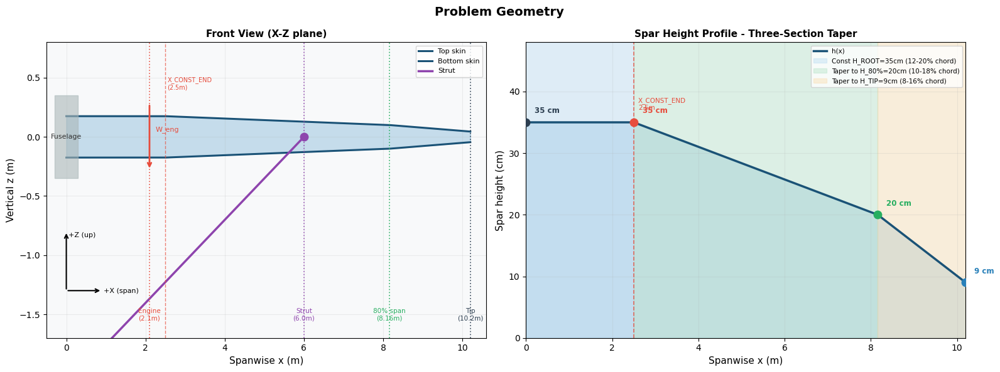
    


**Coordinate system:** +X = spanwise, +Y = forward (leading edge), +Z = upward.

**Spar height — three-section profile:**

| Region | x range | Profile | Height bounds |
|---|---|---|---|
| Inner (constant) | 0 to 2.5 m | h = H\_ROOT | 12-20% of 8 ft root chord: 29.3-48.8 cm |
| Mid taper | 2.5 to 8.16 m | Linear H\_ROOT to H\_80PCT | 10-18% of 5.5 ft mid chord: 16.8-30.2 cm |
| Tip taper | 8.16 to 10.2 m | Linear H\_80PCT to H\_TIP | 8-16% of 3 ft tip chord: 7.3-14.6 cm |

> `X_CONST_END = 2.5 m` is the end of the constant-height inner section. `X_ENGINE_INIT = 2.1 m` is the engine attachment point (only used for load application) and is distinct from `X_CONST_END`.

---
## 3 · Applied Loads


```python
GROSS_WEIGHT=66723.0; LOAD_FACTOR=2.5; FUEL_WEIGHT=8896.0; ENGINE_WEIGHT=3558.0; LD_RATIO=13.0
L_semi = GROSS_WEIGHT * LOAD_FACTOR / 2
L0     = 4 * L_semi / (np.pi * SEMI_SPAN)
x_fine = np.linspace(0, SEMI_SPAN, 300)
q_lift = L0 * np.sqrt(np.maximum(1 - (x_fine/SEMI_SPAN)**2, 0))
q_fuel = np.where(x_fine <= X_STRUT, FUEL_WEIGHT/X_STRUT, 0.0)

fig, axes = plt.subplots(1, 2, figsize=(16, 5))
fig.suptitle('Applied Load Distributions (semi-span, 2.5 g)', fontsize=13, fontweight='bold')

ax = axes[0]; ax.set_facecolor('#F8F9FA')
ax.fill_between(x_fine, 0,  q_lift/1e3, alpha=0.25, color='#2E86C1')
ax.plot(x_fine, q_lift/1e3, color='#2E86C1', lw=2.2, label='Elliptical lift')
ax.fill_between(x_fine, 0, -q_fuel/1e3, alpha=0.25, color='#E67E22')
ax.plot(x_fine, -q_fuel/1e3, color='#E67E22', lw=2.0, ls='--',
        label=f'Fuel weight (root to {X_STRUT:.1f} m)')
ax.axvline(X_ENGINE, color='#E74C3C', ls=':', lw=1.5)
ax.annotate(f'Engine\n-{ENGINE_WEIGHT:.0f} N', xy=(X_ENGINE,0), xytext=(X_ENGINE+0.5,-1.8),
            fontsize=8.5, color='#E74C3C',
            arrowprops=dict(arrowstyle='->', color='#E74C3C', lw=1.2))
ax.axhline(0, color='k', lw=0.7)
ax.set_xlabel('Spanwise x (m)', fontsize=11); ax.set_ylabel('Load intensity (kN/m)', fontsize=11)
ax.set_title('Vertical Loads (positive = upward)', fontsize=11, fontweight='bold')
ax.legend(fontsize=9); ax.grid(True, alpha=0.2)
summary = (f'  Lift semi-span: {L_semi/1e3:.1f} kN\n  Peak at root: {L0:.0f} N/m\n'
           f'  Fuel total: {FUEL_WEIGHT:.0f} N\n  Engine: {ENGINE_WEIGHT:.0f} N')
ax.text(0.97,0.97,summary,transform=ax.transAxes,fontsize=8,va='top',ha='right',
        bbox=dict(boxstyle='round',fc='white',ec='#CCCCCC',alpha=0.9))

ax2 = axes[1]; ax2.set_facecolor('#F8F9FA'); ax2.set_aspect('equal'); ax2.axis('off')
ax2.set_title('Strut Free-Body Geometry', fontsize=11, fontweight='bold')
ax2.plot([0,SEMI_SPAN*0.8], [0,0], color='#1A5276', lw=4, solid_capstyle='round')
ax2.text(SEMI_SPAN*0.4, 0.15, 'Wing spar', ha='center', fontsize=9, color='#1A5276')
ax2.plot(0, 0, 's', ms=12, color='#2C3E50')
ax2.text(0.0, -0.35, 'Root\n(fixed BC)', ha='center', fontsize=8)
sx_w = X_STRUT * 0.8
ax2.plot([sx_w, STRUT_BASE_X*0.8], [0, STRUT_BASE_Z*0.7], color='#8E44AD', lw=3)
ax2.plot(sx_w, 0, 'o', ms=11, color='#8E44AD')
ax2.plot(STRUT_BASE_X*0.8, STRUT_BASE_Z*0.7, 's', ms=11, color='#8E44AD')
ax2.text(sx_w+0.2, 0.15, f'x_strut={X_STRUT:.1f}m', fontsize=8.5, color='#8E44AD')
ax2.text(sx_w*0.5+0.3, STRUT_BASE_Z*0.35, 'Strut (CBAR beam)', fontsize=8.5, color='#8E44AD')
ax2.plot(sx_w, 0, 'D', ms=14, color='#E74C3C', zorder=5)
ax2.text(sx_w-0.3, 0.35, 'RBE2 junction', fontsize=8, color='#E74C3C', ha='center')
ax2.text(STRUT_BASE_X*0.8, STRUT_BASE_Z*0.7-0.25,
         f'Fuselage base\n(x={STRUT_BASE_X:.1f}, z={STRUT_BASE_Z:.1f}m)', fontsize=8, ha='center')
ax2.set_xlim(-0.5, SEMI_SPAN*0.85); ax2.set_ylim(-1.8, 0.8)
plt.tight_layout(); plt.show()
```


    
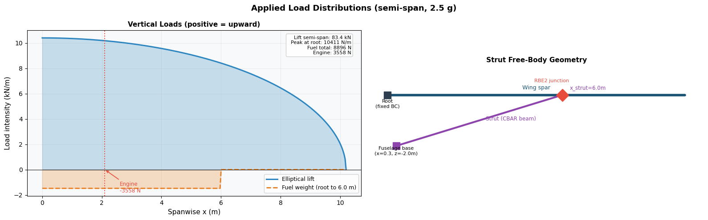
    


| Load | Type | Value | Direction |
|---|---|---|---|
| Aerodynamic lift | Elliptical distribution | 83.4 kN semi-span total | +Z |
| Aerodynamic drag | Elliptical (L/D=13) | 6.4 kN semi-span total | +Y |
| Fuel weight | Uniform, root to x\_strut | 8 896 N | -Z |
| Engine | Point load at x=2.1 m | 3 558 N | -Z |

> The fuel stop tracks `x_strut` dynamically. As the geometric optimizer moves the strut attachment, the fuel boundary moves with it so total fuel weight remains 8 896 N regardless of strut position.

---
## 4 · Design Variables, Bounds & Constraints

### 4.1 TACS Design Variables (adjoint gradient, no BDF rebuild required)

```
0.020 > t_skin  > 0.001  # initial 0.004 — Top/bottom skin shell thickness [m]
0.020 > t_web   > 0.001  # initial 0.005 — Front/rear spar web thickness [m]
0.300 > h_strut > 0.030  # initial 0.140 — Strut rectangular section height [m]
0.250 > b_strut > 0.030  # initial 0.091 — Strut rectangular section width [m]
```

### 4.2 Geometric Design Variables (FD gradient, BDF rebuild each outer step)

```
0.488 > h_root       > 0.293  # initial 0.350 — Inner spar height (12-20% of 8 ft root chord) [m]
0.302 > h_80pct      > 0.168  # initial 0.200 — Spar height at 80% span (10-18% of 5.5 ft chord) [m]
0.146 > h_tip        > 0.073  # initial 0.090 — Tip spar height (8-16% of 3 ft chord) [m]
0.500 > w_spar       > 0.150  # initial 0.300 — Box width front-to-rear spar face [m]
9.000 > x_strut      > 3.500  # initial 6.000 — Strut wing-attachment spanwise position [m]
1.000 > strut_base_x > 0.200  # initial 0.300 — Strut fuselage-base spanwise position [m]
2.500 > strut_base_y > 0.300  # initial 1.000 — Strut fuselage-base forward offset (+Y=fwd) [m]
```

### 4.3 Constraints

```
KS_failure <= 1.0                     # Von Mises via KS aggregation; SF=2.5 built in
                                       # equivalent to max(sigma) <= 503/2.5 = 201 MPa
h_root  >= h_80pct                     # Monotonicity: spar must not grow taller outboard
h_80pct >= h_tip                       # Monotonicity: spar must not grow taller outboard
x_strut - strut_base_x >= 0.05 m      # Strut geometry validity: base inboard of wing attach
```

### 4.4 Fixed Parameters

```
STRUT_BASE_Z = -2.0 m    # Strut base vertical offset — fixed by fuselage geometry
X_CONST_END  =  2.5 m    # End of constant-height inner section
X_80PCT      =  8.16 m   # Taper transition (= 0.8 x semi-span)
SEMI_SPAN    = 10.2 m    # Wing semi-span
```

### 4.5 Material: Aluminium 7075-T6

| Property | Value |
|---|---|
| E (Young's modulus) | 71.7 GPa |
| G (shear modulus) | 26.9 GPa |
| nu (Poisson's ratio) | 0.33 |
| rho (density) | 2 810 kg/m3 |
| sigma_y (yield stress) | 503 MPa |
| Allowable (div 2.5) | 201 MPa |

---
## 5 · Mesh & FEM Architecture


```python
n_inner,n_mid_a,n_mid_b,n_tip = 3,3,3,2
a = np.linspace(0.0, X_CONST_END, n_inner+1)
b = np.linspace(X_CONST_END, X_STRUT, n_mid_a+1)[1:]
c = np.linspace(X_STRUT, X_80PCT, n_mid_b+1)[1:]
d = np.linspace(X_80PCT, SEMI_SPAN, n_tip+1)[1:]
stations = np.concatenate([a,b,c,d])
ht = np.array([spar_height(x)/2 for x in stations])

fig, ax = plt.subplots(figsize=(15,4))
ax.set_facecolor('#F8F9FA'); ax.set_xlim(-0.5, SEMI_SPAN+1); ax.set_ylim(-1.2,1.8); ax.axis('off')
ax.set_title('FEM Mesh Layout', fontsize=12, fontweight='bold')
ax.plot(stations,  ht, color='#1A5276', lw=2.5)
ax.plot(stations, -ht, color='#1A5276', lw=2.5)
for xs in stations:
    h = spar_height(xs)/2
    ax.plot([xs,xs], [-h,h], color='#E67E22', lw=1.5, alpha=0.7)
    ax.plot(xs,  h, 'o', color='#E67E22', ms=5)
    ax.plot(xs, -h, 'o', color='#E67E22', ms=5)
xm = (stations[0]+stations[1])/2
ax.text(xm, 0, 'CQUAD4\n(4/bay)', ha='center', va='center', fontsize=7.5,
        color='#1A5276', bbox=dict(fc='white',ec='#1A5276',alpha=0.8,boxstyle='round'))
for xm,lbl,col in [(X_ENGINE,'Engine','#E74C3C'),
                    (X_STRUT,'Strut junction\n+ RBE2','#8E44AD'),
                    (X_80PCT,'80% span','#27AE60'),
                    (SEMI_SPAN,'Tip (free)','#2980B9')]:
    ax.axvline(xm, color=col, ls='--', lw=1.2, alpha=0.6)
    ax.text(xm, spar_height(xm)/2+0.12, lbl, ha='center', fontsize=7.5,
            color=col, fontweight='bold')
ax.plot([0,0], [-spar_height(0)/2, spar_height(0)/2], color='#2C3E50', lw=5)
ax.text(-0.1, 0, 'Fixed BC\n(SPC 123456)', ha='right', fontsize=8, color='#2C3E50')
ax.plot([X_STRUT, STRUT_BASE_X], [0, -0.9], color='#8E44AD', lw=3)
ax.plot(STRUT_BASE_X, -0.9, 's', ms=10, color='#8E44AD')
ax.text((X_STRUT+STRUT_BASE_X)/2+0.4, -0.45, 'CBAR 30 elem.', fontsize=7.5, color='#8E44AD')
ax.text(STRUT_BASE_X, -1.07, 'Fixed BC', ha='center', fontsize=7.5)
for xlo,xhi,lbl in [(0,X_CONST_END,'Inner (3 bays)'),
                     (X_CONST_END,X_STRUT,'Mid-A (3 bays)'),
                     (X_STRUT,X_80PCT,'Mid-B (3 bays)'),
                     (X_80PCT,SEMI_SPAN,'Tip (2 bays)')]:
    ax.annotate('', xy=(xhi,-1.05), xytext=(xlo,-1.05),
                arrowprops=dict(arrowstyle='<->',color='gray',lw=1.0))
    ax.text((xlo+xhi)/2, -1.18, lbl, ha='center', fontsize=7.5, color='gray')
plt.tight_layout(); plt.show()
```


    
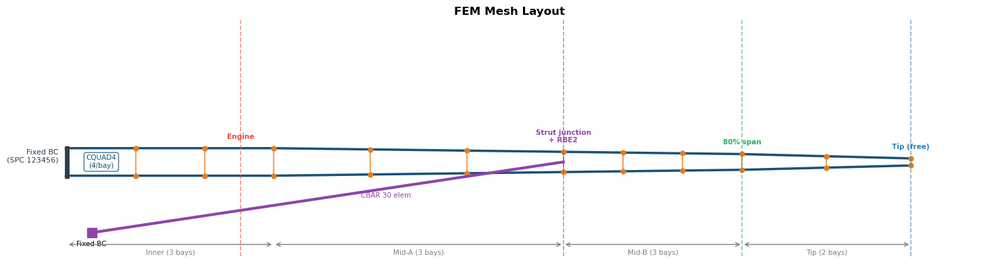
    


| PID | compID | Element | Constitutive model | Design variable |
|---|---|---|---|---|
| 1 | 0 | CQUAD4 skins | IsoShellConstitutive | `t_skin` |
| 2 | 1 | CQUAD4 webs | IsoShellConstitutive | `t_web` |
| 3 | 2 | CBAR strut | IsoRectangleBeamConstitutive | `h_strut`, `b_strut` |

**Total:** 44 CQUAD4 panels (11 bays x 4 surfaces) + 30 CBAR strut elements. Nodes: 48 box corners + 31 strut nodes + 1 RBE2 junction master = **80 structural nodes**.

---
## 6 · Optimisation Architecture

### 6.1 Two-level strategy

Geometric parameters require writing a new BDF and re-initialising TACS, so they cannot share the OpenMDAO adjoint data path with the thickness DVs. The solution is two nested loops:

**Inner loop — `run_optimization(geo_opt_init, n_iter=200)`**
- Runs SLSQP on the 4 TACS DVs at fixed geometry
- Objective: `flight_loads.mass` | Constraint: `KS_failure <= 1.0`
- Gradients: exact adjoint via `prob.setup(mode='rev')`
- Cost: ~30-50 TACS solves to convergence

**Outer loop — `run_geo_descent(geo_init, dv_tacs_init, n_steps=6, lr=0.3)`**

At each of 6 steps:
1. `run_optimization` — optimal TACS DVs at current geometry
2. `compute_geo_gradients` — 14 central-FD solves for 7 geo DVs (step = 0.5% of range)
3. Normalised gradient step on each geo DV
4. Project back into bounds
5. Enforce `h_root >= h_80pct >= h_tip` and `x_strut - strut_base_x >= 0.05 m`

Best feasible point (KS <= 1.05) across all steps is returned.
**Total cost: ~6 x (50 inner + 14 FD) ~ 380 TACS solves**

### 6.2 Gradient computation summary

| DV group | Variables | Gradient method | Cost |
|---|---|---|---|
| TACS DVs | t\_skin, t\_web, h\_strut, b\_strut | TACS adjoint (exact) | 1 reverse solve |
| Geo DVs | h\_root, h\_80pct, h\_tip, w\_spar, x\_strut, strut\_base\_x, strut\_base\_y | Central FD via `run_static` | 14 solves |

---
## 7 · Code Architecture & Key Functions


```python
fig, ax = plt.subplots(figsize=(15, 10))
ax.set_xlim(0, 15); ax.set_ylim(0, 10); ax.axis('off')
ax.set_title('strut_wing_box_opt.py - Execution Flow', fontsize=13, fontweight='bold')

def box(ax, x, y, w, h, label, col, fs=8.5):
    r = mpatches.FancyBboxPatch((x,y), w, h, boxstyle='round,pad=0.08',
                                 facecolor=col, edgecolor='#555', lw=1.3, zorder=3)
    ax.add_patch(r)
    tc = 'white' if col != '#AAB7B8' else '#333'
    ax.text(x+w/2, y+h/2, label, ha='center', va='center', fontsize=fs,
            fontweight='bold', zorder=4, color=tc)

def arr(ax, x0, y0, x1, y1, col='#555'):
    ax.annotate('', xy=(x1,y1), xytext=(x0,y0),
                arrowprops=dict(arrowstyle='->', color=col, lw=1.5), zorder=5)

# Column 1: Setup
for y, lbl, c in [
        (8.8,'[1] generate_bdf()\nWrite Nastran BDF','#2471A3'),
        (7.9,'[2] setup_globals()\nParse coords, load CSV','#2471A3'),
        (7.0,'[3] run_tests()\n7 validation checks','#1E8449'),
        (6.1,'[4] run_static()\nInitial solve + KS','#7D3C98'),
        (5.2,'[5] plot_iso()\nInteractive 3D HTML','#D35400')]:
    box(ax, 0.2, y, 3.0, 0.7, lbl, c)
for y in [8.8,7.9,7.0,6.1]: arr(ax, 1.7, y, 1.7, y-0.1)

# Column 2: Two-level optimisation
box(ax, 3.9, 7.2, 3.3, 2.2,
    '[6A] run_geo_descent()\nProjected gradient descent\n7 geo DVs, 6 steps, lr=0.3\n(outer loop)', '#922B21', fs=8)
box(ax, 3.9, 5.7, 3.3, 1.1, 'run_optimization()\nSLSQP, 4 TACS DVs\nadjoint gradient', '#7D3C98', fs=8)
box(ax, 3.9, 4.4, 3.3, 1.0, 'compute_geo_gradients()\n14 central-FD solves\n7 geo DVs', '#7D3C98', fs=8)
arr(ax, 5.55, 7.2, 5.55, 6.8)
arr(ax, 5.55, 5.7, 5.55, 5.4)
ax.annotate('', xy=(3.9, 7.7), xytext=(3.9, 5.4),
            arrowprops=dict(arrowstyle='->', color='#922B21', lw=1.5,
                           connectionstyle='arc3,rad=-0.45'))
ax.text(3.2, 6.6, 'repeat\n6x', fontsize=8.5, color='#922B21', ha='center')

# Column 3: Post-processing
for y, lbl in [
        (8.8,'[6B] compute_geo_gradients()\nat best point'),
        (7.9,'[6C] plot_sensitivity()\n11-DV bar chart'),
        (7.0,'[6C] plot_gradient_contours()\n6-panel landscape'),
        (6.1,'[6C] plot_strut_contours()\n3-panel strut focus'),
        (5.2,'[7] plot_spanwise_analysis()\n[7] plot_section_properties()')]:
    box(ax, 8.0, y, 3.0, 0.7, lbl, '#117A65', fs=7.8)
for y in [8.8,7.9,7.0,6.1]: arr(ax, 9.5, y, 9.5, y-0.1)
arr(ax, 7.2, 5.8, 8.0, 7.0)

# Output column
for y, lbl in [
        (8.75,'wing_box_iso.html'), (8.05,'sensitivity.png'),
        (7.35,'contour_gradient.png'), (6.65,'contour_strut.png'),
        (5.95,'spanwise_analysis_*.png'), (5.25,'section_properties_*.png')]:
    box(ax, 11.5, y, 3.0, 0.55, lbl, '#AAB7B8', fs=7.5)

# Legend
for col, lbl in [('#2471A3','Setup'),('#7D3C98','TACS/MPhys'),('#922B21','Geo descent (outer)'),
                  ('#1E8449','Validation'),('#117A65','Post-process'),
                  ('#D35400','3D plot'),('#AAB7B8','Output file')]:
    ax.plot([], [], 's', color=col, ms=11, label=lbl)
ax.legend(loc='lower left', fontsize=8, ncol=4, framealpha=0.9)
plt.tight_layout(); plt.show()
```


    
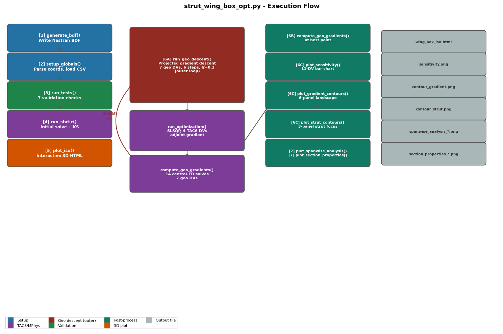
    


| Function | Purpose |
|---|---|
| `generate_bdf(filename, ...)` | Writes Nastran BDF. Call whenever any geometric parameter changes. |
| `setup_globals(bdf, csv, ...)` | Parses BDF coords, loads lift/drag CSV, updates all module globals. |
| `element_callback(...)` | Assigns constitutive models and DV numbers to each compID. |
| `problem_setup(...)` | Registers StructuralMass, KSFailure, Compliance; applies nodal loads. |
| `run_static(dv_override, bdf_path)` | Single static solve. Pass `bdf_path` for geometry FD perturbations. |
| `run_optimization(geo_opt_init, n_iter)` | SLSQP on 4 TACS DVs at fixed geometry. Returns `(prob, dv_opt, mass, KS)`. |
| `compute_geo_gradients(geo_opt, dv_opt)` | Central-FD gradients for 7 geo DVs (14 TACS solves). |
| `run_geo_descent(geo_init, dv_init)` | Outer loop: projected gradient descent on geo DVs. |
| `_build_grad_arrays(prob, dv_opt, dm_geo, dks_geo)` | Merges adjoint + FD gradients into flat (11,) arrays. |
| `plot_iso(disps, disp_scale)` | Plotly HTML: grey ghost + amber deformed overlay, auto-scaled tip deflection. |
| `plot_sensitivity(...)` | 11-DV bar chart: normalised leverage and signed raw gradient. |
| `plot_gradient_contours(...)` | 6-panel first-order mass landscape for paired DVs. |
| `plot_strut_contours(...)` | Dedicated 3-panel strut sizing figure. |
| `plot_spanwise_analysis(disps, dvs)` | 6-panel dashboard: height, AR, EI, BM, SF, uz. |
| `plot_section_properties(dvs)` | 5 to-scale box cross-sections with property table. |

---
## 8 · Running the Script

```bash
# Serial
python strut_wing_box_opt.py

# Parallel (MPI) - speeds up static solves
mpirun -n 4 python strut_wing_box_opt.py
```

| Phase | What happens | Output |
|---|---|---|
| 1 | Write Nastran BDF | `strut_wing_box.bdf` |
| 2 | Parse mesh, load CSV | module globals |
| 3 | 7 validation assertions | console pass/fail |
| 4 | Initial static solve | console: mass, KS |
| 5 | Isometric 3D plot | `output/wing_box_iso.html` |
| 6A | Geo descent: 6 outer steps, each with SLSQP + 14 FD solves | best joint optimum |
| 6B | FD gradients at best point | geo gradient dicts |
| 6C | sensitivity + contour + strut plots | 3 PNG files |
| 7 | Spanwise + section plots (initial and optimised) | 4 PNG files |

---
## 9 · Outputs

### 9.1 Isometric 3D View

Open `output/wing_box_iso.html` in Safari or Chrome. Grey ghost = undeformed; amber panels = deformed, auto-scaled so visual tip deflection is approximately 1 m. Cream spine line traces the top-front edge. Console prints the computed scale factor, e.g. `auto disp_scale = 4.8x (raw tip uz = 21.4 cm -> visual = 1.00 m)`.

### 9.2 Spanwise Analysis - Initial Design


```python
from IPython.display import Image, display as ipy_display
import os

def show(path, width=1050):
    if os.path.exists(path):
        ipy_display(Image(path, width=width))
    else:
        print(f'[Run strut_wing_box_opt.py first]  Expected: {path}')

show(os.path.join('output', 'spanwise_analysis_init.png'))
```


    
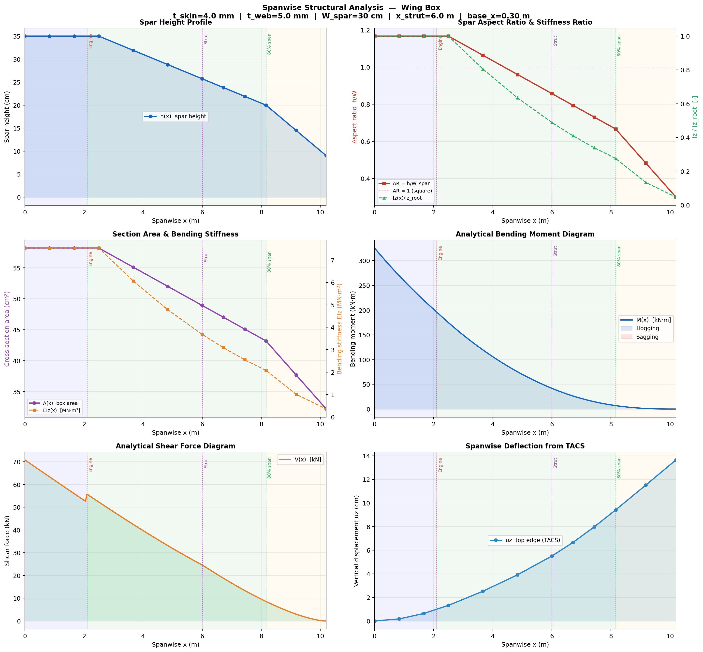
    


Six panels:
1. **Spar height h(x)** - three-section taper with shaded regions. Vertical lines mark X_CONST_END (2.5 m) and engine attachment (2.1 m) separately.
2. **AR = h/W_spar and Iz(x)/Iz_root** - section aspect ratio and normalised bending stiffness.
3. **Section area A(x) and EIz(x)** - cross-sectional area and bending stiffness product.
4. **Analytical bending moment M(x)** - integrated from tip inward. The strut creates a two-hump BM diagram with near-zero at x_strut.
5. **Analytical shear force V(x)** - derivative of BM. Jump at engine point load.
6. **FEM tip deflection uz(x)** - mean vertical displacement per station from TACS.

### 9.3 Spanwise Analysis - Optimised Design


```python
show(os.path.join('output', 'spanwise_analysis_opt.png'))
```


    
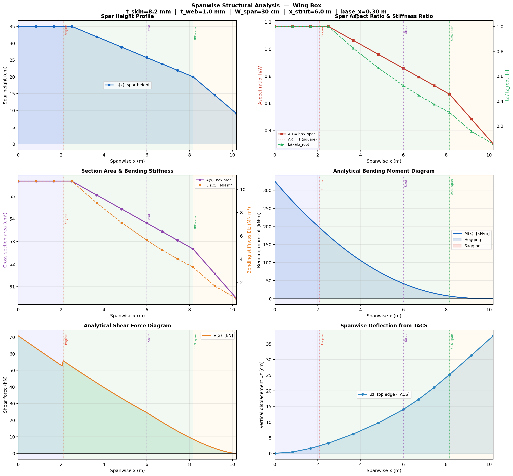
    


At the optimum, compare panels 3 and 6: the optimizer reduces thickness until KS = 1 (active constraint), so section area falls and tip deflection increases. If the geometric descent also moved spar heights, the height profile in panel 1 will differ from the initial design.

### 9.4 Cross-Section Properties


```python
for label, fname in [('Initial design', 'section_properties_init.png'),
                      ('Optimised design', 'section_properties_opt.png')]:
    print(f'\n-- {label} --')
    show(os.path.join('output', fname))
```

    
    -- Initial design --


    
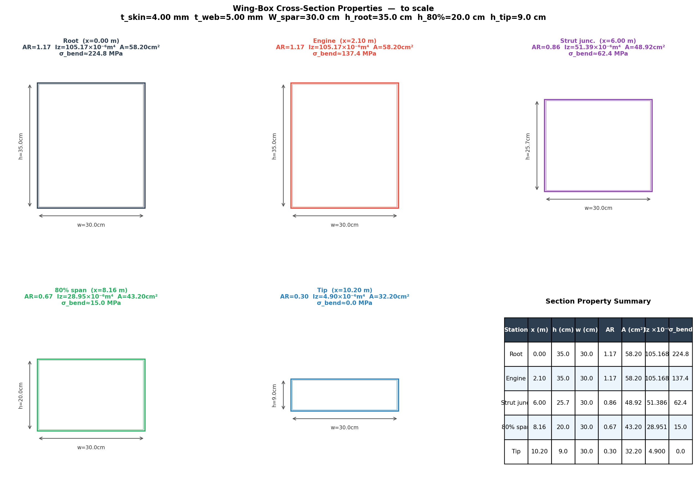
    


    
    -- Optimised design --


    
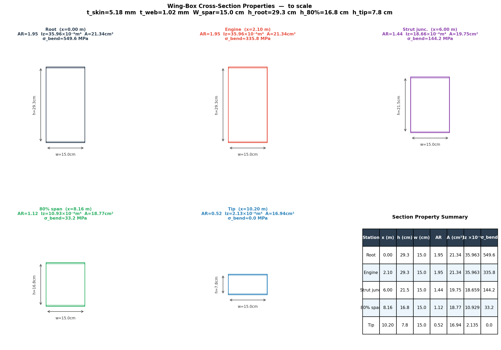
    


Five cross-section drawings at root, engine, strut junction, 80% span, and tip, all drawn **to scale** relative to W_spar. Each panel annotates AR, Iz, A, and estimated bending stress. Summary table bottom-right collects all five stations.

### 9.5 DV Sensitivity Chart


```python
show(os.path.join('output', 'sensitivity.png'))
```


    
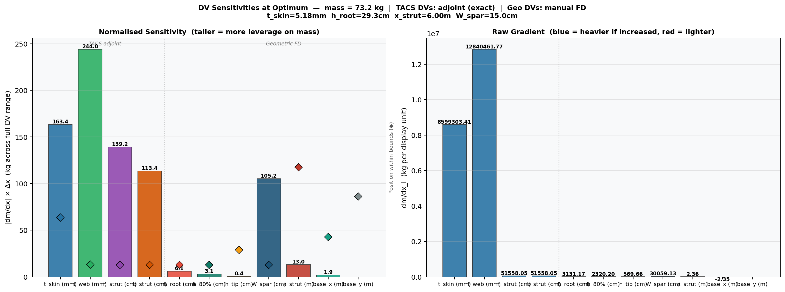
    


Two panels covering all 11 DVs. A vertical dashed line separates the 4 TACS DVs (adjoint, exact) from the 7 geometric DVs (manual FD).

- **Left - Normalised sensitivity** `|dm/dx| x delta_x`: potential mass change if the DV moved its full range. Tallest bar = most leverage at the optimum.
- **Right - Signed raw gradient** `dm/dx` in display units: blue = increasing DV adds mass; red = increasing DV reduces mass.
- **Diamonds** show each DV's position within its bounds. A diamond at the top or bottom indicates an active bound constraint.

### 9.6 First-Order Mass Landscape - All DV Pairs


```python
show(os.path.join('output', 'contour_gradient.png'), width=1200)
```


    
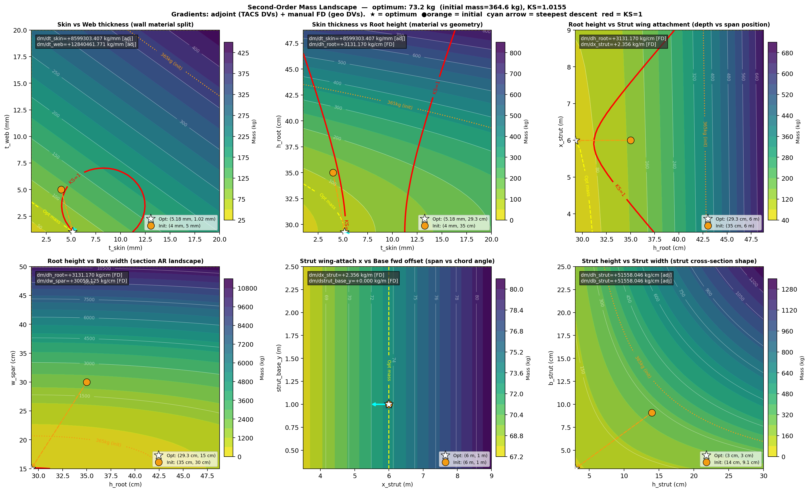
    


Six panels, each a first-order Taylor expansion of mass around the optimum: `M(xi,xj) = M* + gi*(xi-xi*) + gj*(xj-xj*)`

| Panel | Variables | Physical question |
|---|---|---|
| 1 | t_skin vs t_web | How should wall material be split between skins and webs? |
| 2 | t_skin vs h_root | Add skin thickness or raise section depth? |
| 3 | h_root vs x_strut | Root depth vs strut span position (dominant structural trade-off) |
| 4 | h_root vs w_spar | Optimal section aspect ratio (height vs width) |
| 5 | x_strut vs strut_base_y | Span position vs chord-wise strut angle |
| 6 | h_strut vs b_strut | Strut cross-section shape |

**Markers:** white star = optimum from `run_geo_descent`, orange circle = initial design. Dashed orange arrow shows optimizer trajectory in each 2D slice. Red line = KS=1 feasibility boundary. Cyan arrow = steepest mass descent direction. Gradient source annotated `[adj]` or `[FD]` per panel.

### 9.7 Strut Structural Sizing


```python
show(os.path.join('output', 'contour_strut.png'), width=1200)
```


    
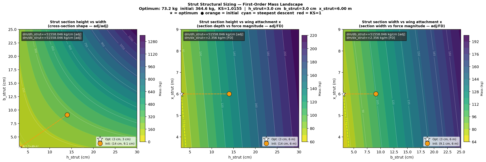
    


Three panels dedicated to the strut, at larger scale than the combined figure:

| Panel | Variables | What it shows |
|---|---|---|
| 1 | h_strut vs b_strut | Cross-section shape. White dotted iso-lines = constant area multiples (0.5x to 2x optimal). Moving along an iso-area curve trades height for width at constant strut mass. |
| 2 | h_strut vs x_strut | Section height vs wing attachment. As x_strut moves outboard the strut lengthens and its axial force grows - deeper section needed. |
| 3 | b_strut vs x_strut | Section width vs wing attachment. Comparing panels 2 and 3 reveals whether height or width is binding at the optimal attachment point. |

h_strut and b_strut gradients are **adjoint** (exact); x_strut is **manual FD** (14 TACS solves).

---
## 10 · Quick Reference

```python
# Full two-level optimisation
python strut_wing_box_opt.py

# Inner TACS optimisation only (at nominal geometry)
geo_nom = dict(h_root=0.35, h_80pct=0.20, h_tip=0.09, w_spar=0.30,
               x_strut=6.0, strut_base_x=0.3, strut_base_y=1.0)
prob, dv_opt, mass_opt, ks_opt = run_optimization(geo_nom, n_iter=200)

# Single static solve at any DV/geometry
generate_bdf(bdf_file, h_root=0.40, w_spar=0.35, x_strut=5.5, strut_base_x=0.3)
setup_globals(bdf_file, csv_file, x_strut=5.5, strut_base_x=0.3)
_, _, disps, funcs = run_static(dv_override=dv_opt)
print(funcs['flight_loads_mass'], funcs['flight_loads_ks_vmfailure'])

# Geometric FD gradients
dm_geo, dks_geo = compute_geo_gradients(geo_nom, dv_opt)
# dm_geo = {'h_root': +XX kg/m, 'x_strut': -XX kg/m, ...}

# Full outer loop from alternative starting geometry
geo_alt = dict(geo_nom); geo_alt['x_strut'] = 5.0
(geo_opt, dv_opt, prob, mass_opt, ks_opt), history = run_geo_descent(
    geo_alt, initial_dvs(), n_steps=8, lr=0.25)
```

---
## 11 · Extending the Model

**Add `strut_base_z` as a DV** - currently fixed at -2.0 m by fuselage geometry. Add it to `compute_geo_gradients` and `run_geo_descent` with a bound based on fuselage crown clearance.

**Add spanwise-varying skin thickness** - currently `t_skin` is a single scalar. Create one PSHELL group per spanwise bay (11 groups), return unique `dvNum` per bay in `element_callback`, and expand `initial_dvs()`. Add monotonicity constraints so skin does not thicken toward the tip.

**Improve geo descent convergence** - replace the fixed `lr` with Armijo backtracking: after computing the gradient direction, halve `lr` until `run_optimization` returns mass strictly below the current best.

**Aerostructural coupling** - `WingBoxModel` is a standard OpenMDAO `Multipoint` group. Promote it into a larger system with a VLM or CFD solver, connecting `flight_loads.dv_struct` into an outer aerostructural coupling loop.
